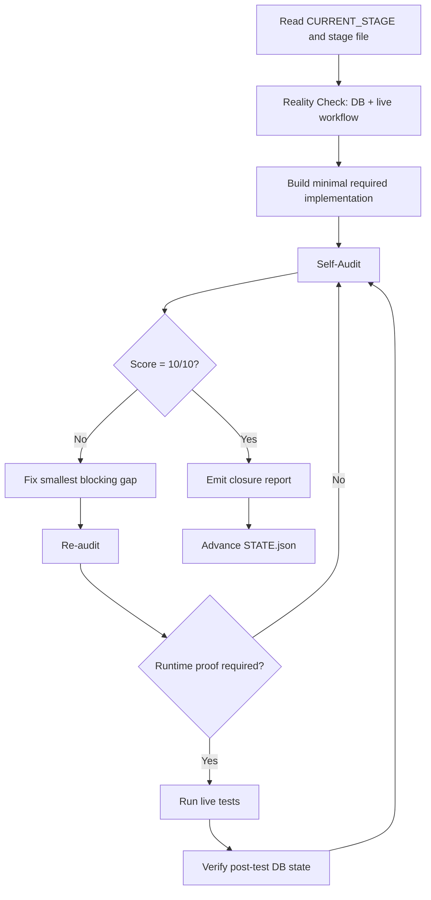

# Execution Loop

This is the mandatory loop for every stage.

## Diagram

## Hard rule

Do not advance the stage after a build pass.  
You may only advance after:
- audit
- fixes
- runtime proof
- post-test verification
- final score 10/10

### SDK divergence hard rule

If the SDK / MCP tool path diverges from documented or expected behavior
(unexpected schema, missing methods, payload rejections that contradict
docs, silent no-ops), do not explore, re-interpret, or reverse-engineer
the SDK. Treat divergence as a degraded tool path, log it, and switch to
the fallback defined in `12_TOOL_FAILURE_MATRIX.md`. Stage shipping
takes priority over SDK introspection.

## Build mode

Build mode means:
- only the minimum changes needed for the current contract
- no opportunistic redesign
- no adjacent cleanup unless it blocks the stage

## Audit mode

Every audit must classify each statement as one of:
- verified by live workflow read
- verified by DB query
- verified by runtime execution
- inferred but not yet executed
- unknown

Unknowns are not allowed in final closure.

## Fix mode

Fixes must be:
- minimal
- contract-aligned
- evidence-driven

Do not fix what is not broken unless it blocks closure.

## Runtime mode

Runtime tests must cover:
- happy path
- idempotency or replay behavior if applicable
- invalid input path
- at least one path specific to the stage contract

## Closure mode

Closure report must state:
- what is live
- what was tested
- what was proven
- what remains outside scope
- whether the next stage is ready

### Evidence-capture must produce next executable path

Every closure report, audit report, or `BLOCKED_WITH_EVIDENCE` artifact
must end with a concrete, executable next action: a specific command,
SQL query, workflow id + operation, file path, or stage identifier that
the next run can invoke without rediscovery. Evidence without a next
executable path is incomplete and does not satisfy closure, even if
findings are otherwise verified.

## Loop-break conditions

Invoke the Loop Breaker when:
- same failed tool path repeated twice
- same update claims success but re-read disproves it
- Claude starts exploring SDK internals rather than shipping the stage
- the workflow shell is at risk of being deleted or blanked
