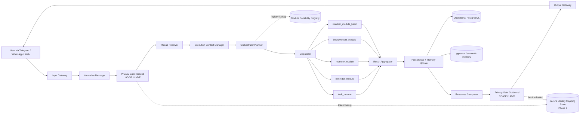
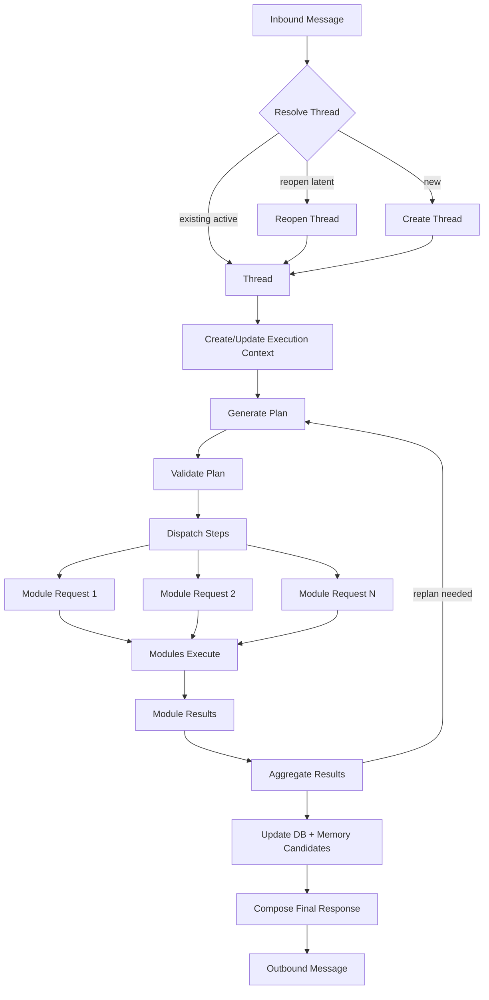
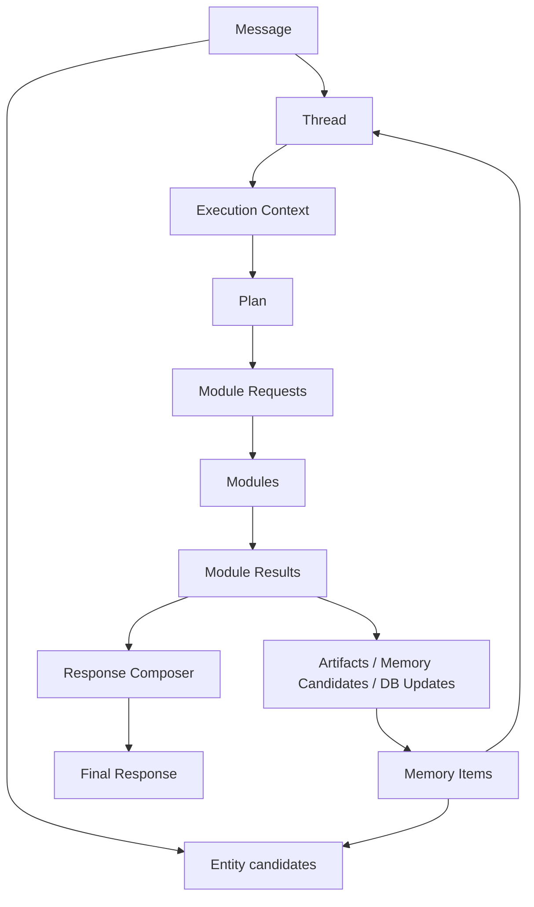
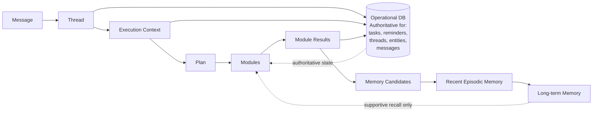
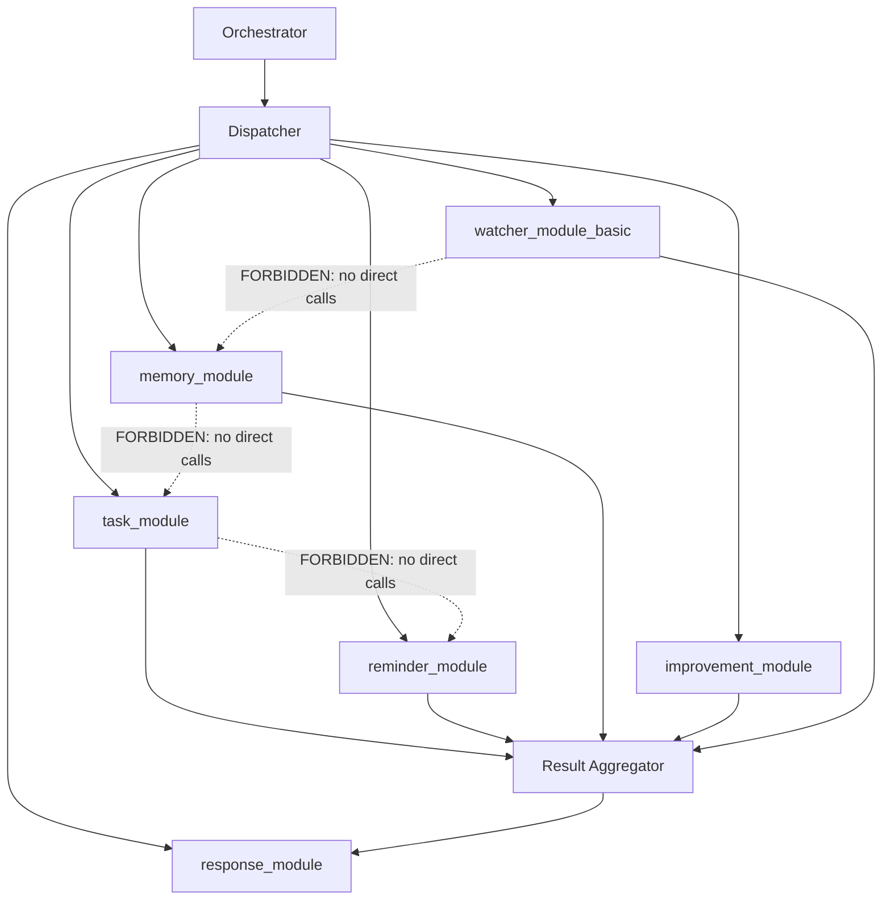
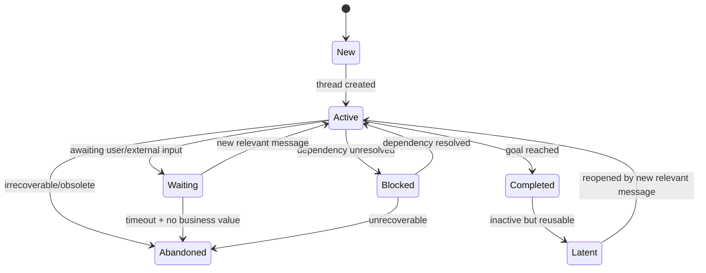
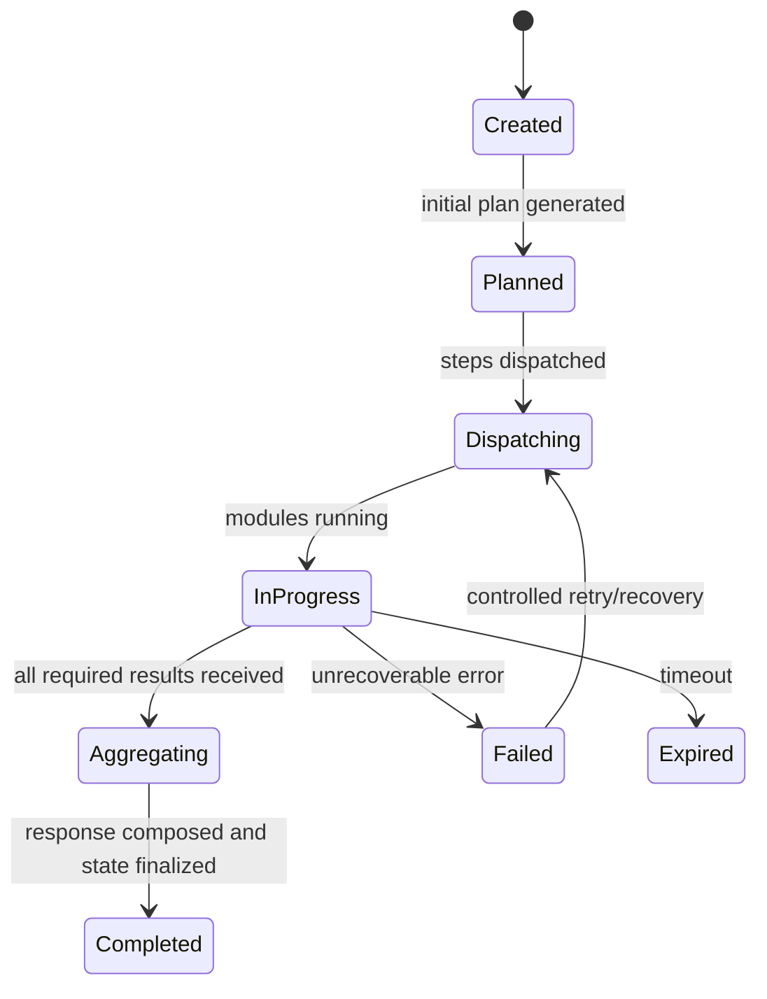
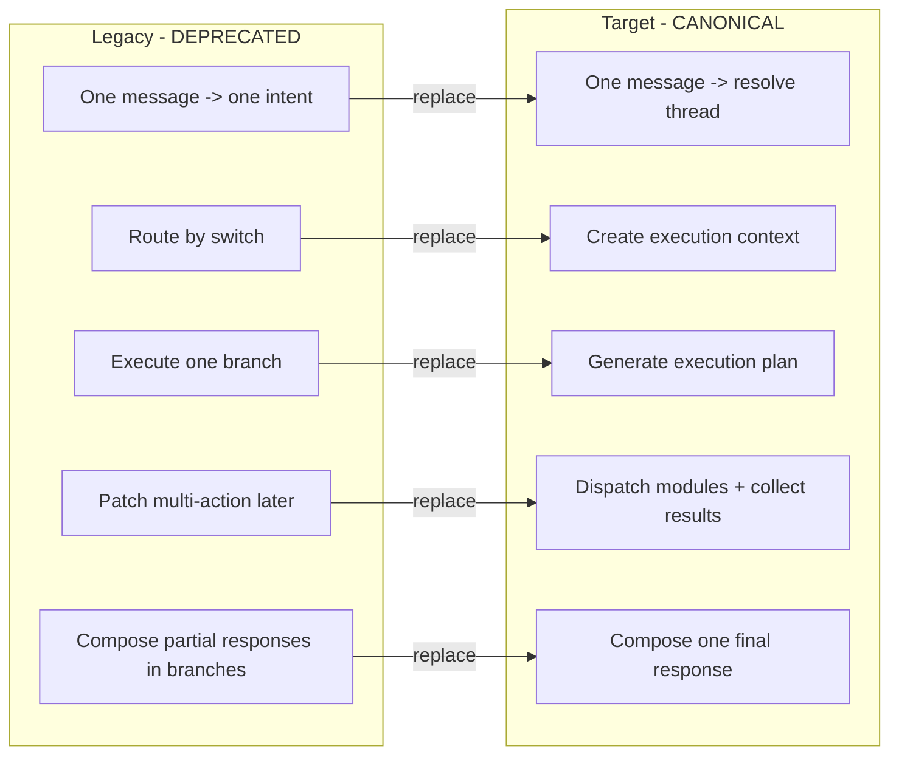
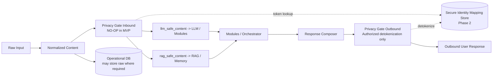

# Architecture Spec v3 — Ucenicul

> **Canonicality: LEVEL 1 — CANONICAL**
> This document is the single authoritative source for Ucenicul's target architecture.
> All subordinate documents must conform to this spec. In case of conflict, this document wins.

---

## A. Metadata

| Field | Value |
|---|---|
| Document | `docs/Architecture_Spec_v3_Ucenicul.md` |
| Version | 3.0 |
| Status | Approved for implementation handoff |
| Owner | Principal architecture authority |
| Audience | Claude, n8n engineer, backend engineer, data engineer, privacy/GDPR implementer |
| Canonicality | Level 1 — Canonical |
| Language | English (Romanian examples allowed without diacritics) |
| Replaced artifacts | Legacy intent-first architectural truth, Architecture_Spec_v2, old README architectural claims, old CLAUDE.md architectural claims |

---

## B. Authority Hierarchy

This section is non-negotiable. Every contributor and every automated agent must obey this hierarchy.

| Level | Document | Governs |
|---|---|---|
| 1 | `docs/Architecture_Spec_v3_Ucenicul.md` (this document) | Architecture truth, object model, lifecycle, orchestrator rules, privacy readiness, diagrams |
| 1 | `docs/Migration_Plan_Ucenicul.md` | Migration truth, cutover order, artifact disposition, rollback rules |
| 2 | `docs/Module_Registry_Ucenicul.md` | Module contracts, activation rules, registry schema |
| 2 | `docs/Module_Spec_*.md` | Module-local contracts, read/write scope, idempotency |
| 2 | `docs/Thread_Resolution_Spec.md` | Thread resolution algorithm, thresholds, audit rules |
| 2 | `docs/Memory_Model_Spec.md` | Memory layers, promotion rules, inference safety |
| 2 | `docs/n8n_Workflow_Mapping.md` | n8n execution layout, node ownership, PostgreSQL query policy |
| 3 | `CLAUDE.md` | Repo-level instructions for Claude (subordinate to this spec) |
| 3 | Root `README.md` | Repo orientation only (subordinate to this spec) |
| 3 | `db/README.md`, `db/schema/README.md` | Implemented schema + schema delta documentation |
| 4 | Migration PDFs (after absorption) | Historical reference only |
| 4 | Technical guide PDF (after absorption) | Historical reference only |
| 4 | `COMPILARIS_UCENICUL_OVERVIEW.md` | Business reference only, not engineering truth |
| 4 | `COMPILARIS_RAG_MESSAGES.md` | Test fixture only, not implementation truth |
| 4 | Legacy PNG diagrams | Superseded by Mermaid source in this spec |

**Explicit scope limits:**

- `brain_contract.json` governs **intent/field validation only** within the brain layer. It does not govern system-level architecture.
- DB docs govern **implemented schema plus documented schema delta**. They do not define architectural direction.
- n8n Workflow Mapping governs **n8n execution layout**. It does not override architectural contracts defined here.

---

## C. Scope and Non-scope

### In scope

- Message ingestion and normalization
- Thread resolution
- Execution context lifecycle
- Planning and replanning
- Dispatcher and module contracts
- Operational persistence boundaries
- Memory model (working, recent episodic, long-term)
- Watcher path
- Response composition
- n8n target mapping
- MCP extensibility
- Observability and audit
- Privacy readiness for Phase 2
- Migration from current system

### Not in scope

- Full pseudonymization implementation in MVP
- Redefining the product as non-modular
- Treating RAG as source of truth for operational state
- Marketing copy or portfolio positioning
- Replacing subordinate module specs, DB docs, or workflow mapping docs (those are governed by their own Level 2/3 documents, subordinate to this spec)

---

## D. Current State vs Target State vs Phase 2 Matrix

| Concern | Current State (MVP monolith) | Target State (modular architecture) | Phase 2 (privacy-complete) |
|---|---|---|---|
| Message routing | One message -> one primary intent -> route by switch | One message -> resolve thread -> plan -> dispatch modules | Same as Target + privacy gate inbound active |
| Thread resolution | Implicit or absent; messages exist standalone | Explicit thread resolver with scoring algorithm | Same as Target |
| Execution context | Not formalized; state scattered across n8n branches | Explicit Execution Context object per trigger message | Same as Target |
| Planning | No plan object; branch selection is implicit | Explicit Plan object with steps, dependencies, replan rules | Same as Target |
| Module contracts | Logic embedded in n8n branches, no formal contracts | Strict Module Request / Module Result contracts | Same as Target + consumed_content_class mandatory |
| Response composition | Per-branch partial responses aggregated loosely | One final response composed after result aggregation | Same as Target + detokenization at outbound boundary |
| Memory model | Ad hoc RAG writes piggybacked in branches | Three-tier memory model with promotion rules | Same as Target + token/entity references only |
| Privacy | Not implemented; raw PII flows everywhere | NO-OP privacy gates in place; content class fields exist | Full pseudonymization, NER, secure identity mapping |
| Persistence | PostgreSQL + pgvector, but schema doesn't match target objects | PostgreSQL + pgvector with schema aligned to canonical objects | Same as Target + secure identity mapping store separate |
| Observability | Basic error logging | Structured audit records for all lifecycle events | Same as Target + privacy access audit trail |
| brain_contract.json | Elevated as central truth for intents and validation | Scoped to intent/field validation only; architecture spec governs system | Same as Target |
| n8n PostgreSQL queries | Mixed $1/$2 placeholders and inline interpolation | One canonical query policy defined in n8n_Workflow_Mapping.md | Same as Target |

---

## E. Architectural Principles

1. **Modular-first.** The architecture is modular and stays modular. Modules own domain logic.
2. **Thread-first.** Every inbound message must resolve to a thread before planning begins.
3. **Plan-first.** A message may trigger zero, one, or many actions. The orchestrator generates an explicit plan.
4. **One final response.** User-facing composition happens once, at the end, after module result aggregation.
5. **Explicit source-of-truth boundaries.** Operational state lives in relational persistence. Memory is supportive, never authoritative for operational status.
6. **Privacy-ready by design.** MVP runs with NO-OP privacy gates, but all contracts support Phase 2 content separation.
7. **Current-state honesty.** Documentation distinguishes active MVP behavior from target architecture and from Phase 2 readiness.
8. **No hidden cross-node coupling.** Nodes and modules read explicit inputs from execution context and contracts, not incidental upstream state.
9. **Idempotent writes.** All write-capable modules must be safe under retry.
10. **Explicit contracts everywhere.** Orchestrator-module communication uses strict Module Request / Module Result schemas.

---

## F. Core Canonical Objects

### F.1 Message

A Message is an observed communication event, inbound or outbound.

**Required fields:** `id`, `tenant_id`, `channel`, `direction`, `author_type`, `raw_content`, `normalized_content`, `llm_safe_content`, `rag_safe_content`, `timestamp`, `source_message_ref`, `status`

**Optional fields:** `author_entity_id`, `thread_id`, `related_entity_ids`, `privacy_transform_version`, `metadata`

**Rules:**

- `raw_content` may contain raw PII.
- `normalized_content` is structural normalization only.
- `llm_safe_content` and `rag_safe_content` may equal `normalized_content` in MVP.
- In Phase 2, `llm_safe_content` and `rag_safe_content` are produced by Privacy Gate Inbound.
- A Message is not an operational task, reminder, or memory item.
- A Message may generate zero, one, or many downstream actions.

### F.2 Thread

A Thread is the persistent operational container for one subject of continuity.

**Required fields:** `id`, `tenant_id`, `title`, `thread_type`, `status`, `summary`, `last_activity_at`, `created_at`, `updated_at`

**Optional fields:** `primary_entity_id`, `related_entity_ids`, `goal`, `source_channels`, `closure_reason`

**Rules:**

- A thread may exist without a primary entity.
- Threads may be: active, waiting, blocked, completed, latent, abandoned.
- Thread continuity is semantic and operational, not merely temporal.
- A thread may be reopened by a new relevant message.

### F.3 Entity

An Entity is a persistent operational object with stable business value that may accumulate profile and memory over time.

**Required fields:** `id`, `tenant_id`, `entity_type`, `display_name`, `status`, `created_at`, `updated_at`

**Optional fields:** `canonical_name`, `aliases`, `contact_mappings`, `profile_summary`, `labels`, `metadata`

**Rules:**

- Do not create entities for every noun mention.
- Create entity only when recurrence, operational value, or explicit user framing is clear.
- In privacy-ready design, stable token mapping belongs in a separate secure identity mapping store.

### F.4 Execution Context

Temporary state of one execution attempt triggered by one inbound message.

**Required fields:** `id`, `tenant_id`, `thread_id`, `trigger_message_id`, `status`, `current_goal`, `current_plan_ref`, `pending_steps`, `completed_steps`, `created_at`, `updated_at`

**Optional fields:** `module_results`, `working_notes`, `shared_artifacts`, `error_state`, `retry_state`

**Rules:**

- Execution Context is temporary and expires.
- It is not thread history.
- It is not long-term memory.
- It may be durably persisted for observability and recovery.
- It dies when the execution completes, fails permanently, or expires.

### F.5 Plan

The orchestrator's structured execution strategy for the current execution.

**Required fields:** `plan_id`, `execution_context_id`, `thread_id`, `goal`, `primary_intent`, `steps`, `status`, `reasoning_summary`

**Rules:**

- The plan may be revised (replanning).
- The plan may include sequential and parallel steps.
- Each step belongs to exactly one module.

### F.6 Plan Step

**Required fields:** `step_id`, `module_name`, `purpose`, `inputs`, `depends_on`, `execution_mode`, `expected_outputs`, `replan_if`, `failure_policy`, `status`

### F.7 Module Request

**Required fields:** `execution_context_id`, `thread_id`, `step_id`, `module_name`, `purpose`, `inputs`, `idempotency_key`

**Optional fields:** `target_entity_id`, `target_artifact_id`, `hints`, `privacy_mode`

**Rule:** Module Request MUST NOT include the full raw history by default.

### F.8 Module Result

**Required fields:** `module_name`, `step_id`, `result_type`, `status`, `summary`, `observations`, `proposals`, `actions_executed`, `artifacts`, `confidence`, `needs_followup`, `followup_requests`

**Allowed statuses:** `success`, `partial`, `failed`, `no_action`

**Allowed result types:** `analysis`, `proposal`, `execution`, `artifact`, `notification`, `error`

### F.9 Memory Item

**Required fields:** `id`, `tenant_id`, `memory_type`, `category`, `content`, `confidence`, `importance`, `durability`, `source_message_id`, `source_thread_id`, `created_at`, `updated_at`

**Optional fields:** `entity_id`, `evidence_refs`, `status`, `supersedes_memory_id`

**Allowed memory types:** `fact`, `observation`, `pattern`, `inference`, `preference`, `constraint`

---

## G. Thread Resolution Rules

Thread resolution must happen before planning.

### Priority order

1. Explicit thread reference in message
2. Direct reply linkage (e.g., reply_to_thread_id)
3. Active thread with same primary entity AND high semantic match
4. Active thread with strong semantic match alone
5. Latent thread with strong semantic AND temporal relevance
6. Create new thread

### Ambiguity handling

- If confidence is below the strict attach threshold, create a new thread.
- If multiple candidates are plausible and none dominates, create a new thread rather than contaminating an existing one.

### Reopen rules

- Reopening a latent thread must be explicit in state transitions (latent -> active).
- Reopen threshold must be met before reattaching.

### Confidence threshold behavior

- Below STRICT_ATTACH_THRESHOLD: create new thread.
- At or above STRICT_ATTACH_THRESHOLD: attach to best candidate.
- At or above REOPEN_THRESHOLD on a latent thread: reopen that thread.

### Auditability requirements

- Thread resolver must log all candidate thread IDs, scores, and the final decision.
- The decision log must be stored in the execution context or audit trail.

Full algorithm pseudocode and threshold values are defined in `docs/Thread_Resolution_Spec.md`.

---

## H. Strict Separation Rules

| Concept | What it is | What it is NOT |
|---|---|---|
| Thread | Continuity container for one operational subject | Not execution state, not memory |
| Execution Context | Temporary state of one execution attempt | Not the thread itself, not long-term memory, not history |
| Operational DB | Authoritative state for tasks, reminders, threads, messages, entities, execution records | Not a semantic search engine, not memory |
| Memory | Supportive semantic layer for recall, context, and learned patterns | Not authoritative for operational state (task completion, reminder status) |

**Hard rules:**

- A thread summary is not the same as recent episodic memory.
- RAG does not own task completion status.
- Execution context must not become a hidden persistence layer for business state.
- Module results may propose memory promotion but do not become memory automatically.

---

## I. Orchestrator Responsibilities and Prohibitions

### Responsibilities

The orchestrator MUST:

- Read the inbound message in thread context
- Resolve thread before planning
- Initialize or update execution context
- Generate initial plan
- Validate plan structure
- Dispatch steps in legal order via dispatcher
- Collect module results
- Trigger replanning when rules require it
- Trigger persistence updates (DB, memory promotion)
- Call response composer once at the end
- Finalize execution state

### Prohibitions

The orchestrator MUST NOT:

- Directly own domain writes that belong to modules (tasks, reminders, etc.)
- Directly compose partial user responses in branches
- Allow modules to call other modules directly
- Compose final user response before all relevant steps have settled
- Leak raw PII to LLM/RAG in target architecture

---

## J. Dispatcher Rules

The dispatcher MUST:

- Validate plan schema before dispatching
- Execute only registered modules
- Enforce dependency order from plan steps
- Provide only the inputs required by the module contract
- Pass idempotency keys downstream
- Collect standardized Module Result objects

The dispatcher MUST NOT:

- Synthesize business logic
- Mutate module outputs
- Bypass module boundaries
- Supply full message history unless a module spec explicitly permits it

---

## K. Module Contract Rules

Each module MUST have:

- Clear scope definition
- Strict input contract (Module Request schema)
- Explicit readable sources (what DB/memory it may read from)
- Explicit writable targets (what DB/memory it may write to)
- Deterministic output schema (Module Result)
- No hidden cross-module calls
- Idempotency policy
- Privacy profile (which content class it consumes)

Modules MUST NOT call other modules directly. Only the orchestrator decides cross-module sequencing.

---

## L. Module Minimum Set

The following modules are required for the MVP target architecture:

| Module | Purpose | Status |
|---|---|---|
| `task_module` | Creates, updates, lists, closes operational tasks | MVP required |
| `reminder_module` | Creates, updates, lists, triggers reminders | MVP required |
| `memory_module` | Manages memory promotion, recall, and semantic search | MVP required |
| `improvement_module` | Captures feedback, suggestions, and system improvement requests | MVP required |
| `watcher_module_basic` | Passive detection of patterns, anomalies, operational signals | MVP required |
| `response_module` | Composes one final user-facing response from aggregated results | MVP required — owns response composition |

**Future modules (not MVP):** `entity_resolution_module`, `social_media_module`, `calendar_module`, `crm_integration_module`, `billing_invoice_module`

**Response composition ownership:** The `response_module` (or Response Composer component) is the sole owner of final user-facing text composition. No other module may produce user-facing response fragments that bypass the response composer.

---

## M. Memory Model

### Working Memory

- Scope: current execution only
- Lives inside the Execution Context
- Contains: current plan, temporary results, step outputs, transient notes, shared artifacts
- Must NOT contain: long-term profile conclusions, full message history dumps, arbitrary raw RAG copies

### Recent Episodic Memory

- Scope: approximately 7 to 30 days, configurable
- Contains: recent operational episodes, thread summaries, repeated observations not yet promoted, recent watcher findings, short narrative continuity

### Long-term Memory

- Scope: persistent
- Contains only: stable facts, validated patterns, durable preferences, durable constraints, operational inferences that passed the evidence threshold

### Promotion Rules

- Working -> Recent: only if useful beyond current execution, after execution closes
- Recent -> Long-term: only if confirmed, repeated, or explicitly validated by user
- No direct jump from one raw message to strong long-term inference unless explicitly confirmed by user

### Inference Safety

- Subjective character judgments are forbidden (e.g., "X este neserioasa")
- Operationally framed observations are allowed (e.g., "X trimite frecvent informatii cu intarziere")
- A pattern MUST NOT be stored after a single observation unless the user explicitly states it as enduring truth

### Observation -> Pattern Rules

- A single observation remains an observation
- Two or more corroborating observations may be promoted to a pattern candidate
- Pattern candidates require validation before becoming long-term patterns

---

## N. Watcher Rules

Watcher modules are non-central modules that detect passive learnings or operational signals.

**Watchers MAY:**

- Propose memory items (observations, patterns, anomalies)
- Propose improvement tickets
- Propose follow-up prompts

**Watchers MUST NOT:**

- Directly send user-facing responses
- Modify operational DB outside their declared write scope
- Bypass orchestrator aggregation and promotion rules

**Watcher output handling:**

- All watcher outputs pass through the Result Aggregator
- Memory proposals from watchers are subject to the same promotion rules as any other module's proposals
- In Phase 2, watchers must consume `llm_safe_content` and token/entity references, not raw PII

---

## O. Response Composition Rules

Response composition happens ONCE after result aggregation.

**Inputs:**

- Thread summary
- Aggregated module results
- Unresolved follow-ups
- Output boundary rules (privacy gate outbound)

**Rules:**

- No module-specific partial response fragments become final truth by default
- Success, partial success, and failure must all be representable
- Response must acknowledge what was executed, what was not executed, and what needs clarification
- In Phase 2, detokenization happens only at the authorized outbound boundary
- The Response Composer is the sole producer of user-facing text

---

## P. Error Handling / Idempotency / Retry / Recovery

**Hard rules:**

- All write-capable modules need deterministic idempotency keys
- Retries must be safe against duplicate side effects
- Module results must indicate whether retry is allowed
- Execution context must record retry count and last failure class
- Recovery may resume from the last safe completed step
- Partial success must never be reported as full success
- Failed steps must produce a Module Result with status `failed` and clear error information

---

## Q. Lifecycle Rules

### Thread Lifecycle

```
new -> active -> waiting/blocked -> completed -> latent -> reopened/abandoned
```

| State | Meaning |
|---|---|
| new | Just created |
| active | Subject continuity persists, execution may be ongoing |
| waiting | Pending input or scheduled continuation |
| blocked | Dependency unresolved |
| completed | Goal reached |
| latent | Inactive but semantically reusable |
| abandoned | Irrecoverable or obsolete |

### Execution Context Lifecycle

```
created -> planned -> dispatching -> in_progress -> aggregating -> completed / failed / expired
```

| State | Meaning |
|---|---|
| created | Execution context initialized |
| planned | Initial plan generated |
| dispatching | Steps being dispatched to modules |
| in_progress | Modules executing |
| aggregating | All required results received, aggregation in progress |
| completed | Response composed and state finalized |
| failed | Unrecoverable error |
| expired | Timeout reached |

---

## R. Operational Persistence Ownership

The Operational DB (PostgreSQL) is authoritative for:

- organizations, tenants
- messages (with all content class fields)
- threads
- entities
- execution_contexts
- tasks
- reminders
- improvement_requests
- memory metadata (if relationally mirrored)
- privacy_audit_records

RAG/semantic store (pgvector) is authoritative ONLY for vector search and memory retrieval. It is NEVER authoritative for operational status (task completion, reminder triggers, thread state).

---

## S. n8n Target Mapping

Target n8n node/component layout:

1. Input Gateway
2. Normalize Message
3. Privacy Gate Inbound (NO-OP in MVP)
4. Resolve Tenant / Organization
5. Thread Resolver
6. Execution Context Manager
7. Load Thread + Operational Context
8. Load Memory Context
9. Orchestrator Planner
10. Plan Validator
11. Dispatcher
12. Module sub-workflows (task, reminder, memory, improvement, watcher)
13. Result Aggregator
14. Persistence Updater
15. Memory Promotion Handler
16. Response Composer
17. Privacy Gate Outbound (NO-OP in MVP)
18. Output Gateway
19. Observability / Audit Log

**n8n hardening rules:**

- No hidden data grabs across branches
- Sub-workflows must obey Module Request / Module Result contracts
- Every write node must be recoverable and auditable
- Branch-local formatting is forbidden as final response logic
- Canonical PostgreSQL query policy is defined in `docs/n8n_Workflow_Mapping.md`

---

## T. MCP Extensibility Rules

MCP is optional for future modules.

**Rules:**

- MCP modules are subordinate to the same module registry and contracts
- The orchestrator does not care whether a module is local n8n or external MCP, as long as contracts match
- MCP modules must declare: privacy profile, latency expectations, failure semantics
- External modules must not receive raw PII in target privacy architecture unless explicitly authorized

---

## U. Observability / Audit Requirements

Required audit records for every execution:

- Inbound message receipt
- Thread resolution candidates, scores, and decision
- Execution context creation/update
- Plan version and replan reasons
- Module request dispatch (per step)
- Module result receipt (per step)
- DB writes and memory promotions
- Response composition outcome
- Privacy transformations and detokenization events (Phase 2)
- Failure class and retry actions

---

## V. Privacy Contracts

> **Status: Contracts defined. Implementation is NO-OP in MVP. Phase 2 activates full pipeline.**

### Content Classes

Every message contract must support these four content fields:

| Field | Description | MVP behavior | Phase 2 behavior |
|---|---|---|---|
| `raw_content` | Original payload, may contain raw PII | Stored as-is | Stored as-is, access-restricted |
| `normalized_content` | Structural normalization only | Produced by normalizer | Produced by normalizer |
| `llm_safe_content` | Content safe for LLM consumption | Equals `normalized_content` | Produced by Privacy Gate Inbound (tokenized) |
| `rag_safe_content` | Content safe for RAG indexing | Equals `normalized_content` | Produced by Privacy Gate Inbound (tokenized) |

### Secure Identity Mapping Store

- **Separate persistence boundary** from main operational tables
- Stable token per contact/entity within tenant scope
- Reverse mapping (detokenization) allowed only to authorized components
- Audit trail for every detokenization or identity lookup
- NOT implemented in MVP; architecture contracts prepare for it

### Token Rules

- Tokens must be stable per contact/entity within tenant scope
- Tokens must not be regenerated arbitrarily per message
- Modules and watchers must prefer token references or `entity_id`
- Raw names in module contracts are transitional only and not target-state truth

### Content Class Consumed by Each Module/Watcher

| Module | MVP consumption | Target consumption |
|---|---|---|
| task_module | normalized_content | llm_safe_content |
| reminder_module | normalized_content | llm_safe_content |
| memory_module | normalized_content | llm_safe_content + rag_safe_content |
| improvement_module | normalized_content | llm_safe_content |
| watcher_module_basic | normalized_content | llm_safe_content |
| response_module | module results (aggregated) | module results + detokenized output at outbound boundary |

### Privacy-mode-ready Contracts

- `Module Request` includes optional `privacy_mode` field
- `Module Result` can declare privacy-sensitive artifacts
- Response Composer receives detokenized or tokenized artifacts only through explicit outbound boundary logic
- Module specs declare which content class they consume

### Detokenization Auditability

- Every detokenization event must be logged with: who requested, what token, what context, timestamp
- Detokenization only occurs at the authorized outbound boundary (Privacy Gate Outbound)

### Outbound Authorization Boundary

- Default authorized boundary: outbound user response
- Any other output (logs, exports, integrations) must declare their authorization level
- Unauthorized outputs receive tokenized content only

---

## W. Transitional Implementation Layer Rules

**The current monolithic n8n workflow may remain ONLY as a transitional implementation layer.**

Rules:

- The current monolith is NOT the target architecture
- No new design work may optimize the old route-by-intent model as central truth
- Existing task/reminder CRUD SQL may be wrapped in module contracts rather than immediately rewritten
- Existing parser/brain logic may remain temporarily while planner/module contracts are introduced
- All transitional wrappers must be documented in the Migration Plan with explicit sunset criteria
- Transitional code must not introduce new coupling to the old pattern

---

## X. Schema Gap Register

| Target Object | Current Schema Status | Required Target Columns | Implementation Status |
|---|---|---|---|
| messages | Partially exists (messages table) | raw_content, normalized_content, llm_safe_content, rag_safe_content, privacy_transform_version, thread_id, author_entity_id | llm_safe_content and rag_safe_content NOT YET IMPLEMENTED; thread_id may not exist |
| threads | NOT YET IMPLEMENTED | id, tenant_id, title, thread_type, status, summary, last_activity_at, primary_entity_id, related_entity_ids, goal, source_channels, closure_reason, created_at, updated_at | NOT YET IMPLEMENTED |
| entities | NOT YET IMPLEMENTED | id, tenant_id, entity_type, display_name, canonical_name, aliases, contact_mappings, profile_summary, labels, status, metadata, created_at, updated_at | NOT YET IMPLEMENTED |
| execution_contexts | NOT YET IMPLEMENTED | id, tenant_id, thread_id, trigger_message_id, status, current_goal, current_plan_ref, pending_steps, completed_steps, module_results, working_notes, error_state, retry_state, created_at, updated_at | NOT YET IMPLEMENTED |
| plans | NOT YET IMPLEMENTED | plan_id, execution_context_id, thread_id, goal, primary_intent, steps (JSONB), status, reasoning_summary | NOT YET IMPLEMENTED |
| tasks | Exists (current CRUD) | Needs alignment check with module contract | PARTIALLY IMPLEMENTED |
| reminders | Exists (current CRUD) | Needs alignment check with module contract | PARTIALLY IMPLEMENTED |
| memory_items | Partially exists (pgvector) | id, tenant_id, memory_type, category, content, confidence, importance, durability, source_message_id, source_thread_id, entity_id, evidence_refs, status, supersedes_memory_id | PARTIALLY IMPLEMENTED — schema delta needed |
| privacy_audit_records | NOT YET IMPLEMENTED | id, tenant_id, event_type, token, context, requester, timestamp | NOT YET IMPLEMENTED (Phase 2) |
| secure_identity_mapping | NOT YET IMPLEMENTED | id, tenant_id, entity_id, token, real_identity_ref, created_at | NOT YET IMPLEMENTED (Phase 2) |
| module_registry | NOT YET IMPLEMENTED | Can be JSON file or DB table: module_name, description, capabilities, module_type, inputs_expected, outputs_produced, can_read_from, can_write_to, activation_rules, status, privacy_profile, idempotency_requirements | NOT YET IMPLEMENTED |

---

## Y. Canonical Diagrams

### Y.1 High-level Orchestration Flow



### Y.2 End-to-end Message Flow



### Y.3 Object Relationship Map



### Y.4 Thread vs Execution Context vs Memory vs Operational DB Boundary Map



### Y.5 Module Interaction Diagram



### Y.6 Thread Lifecycle



### Y.7 Execution Context Lifecycle



### Y.8 Migration Map: Old -> New



### Y.9 Privacy Boundary Diagram



---

## Z. Not Available for Audit Appendix

The following artifacts were referenced in legacy documentation but were NOT available during the audit that produced this spec. Their contents could not be verified.

| Artifact | Referenced by | Status |
|---|---|---|
| `Architecture_Spec_v2_-_Ucenicul.pdf` | Consolidated Architecture Spec v3 audit notes | Not available for audit |
| `architecture.md` | Legacy README references | Not available for audit |
| `repository-structure.md` | Legacy README references | Not available for audit |
| Legacy `CLAUDE.md` (original version) | Referenced in audit | Content inferred from audit notes; original file not in audit corpus |
| Legacy root `README.md` (original version) | Referenced in audit | Content inferred from audit notes; original file not in audit corpus |

These artifacts are treated as non-canonical. If they are later found, they must be classified under the authority hierarchy defined in Section B.

---

## Document Canonicality Footer

> **This document is Level 1 — Canonical.**
> Version: 3.0 | Last updated: 2026-04-15 | Status: Approved for implementation handoff
> All subordinate documents must conform to this spec. In case of conflict, this document wins.
