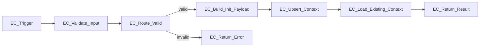

# WF-EC-01 Connection Map

> Authoritative diagram for the native n8n workflow JSON blueprint
> (`WF-EC-01_blueprint.json` / `WF-EC-01_Execution_Context.json`).

## Graph (Mermaid)

## Edge table

| From | Output index | To | Notes |
|---|---|---|---|
| EC_Trigger | main[0] | EC_Validate_Input | — |
| EC_Validate_Input | main[0] | EC_Route_Valid | — |
| EC_Route_Valid | main[0] (valid) | EC_Build_Init_Payload | `_valid === 'true'` |
| EC_Route_Valid | main[1] (invalid) | EC_Return_Error | `_valid === 'false'` |
| EC_Build_Init_Payload | main[0] | EC_Upsert_Context | — |
| EC_Upsert_Context | main[0] | EC_Load_Existing_Context | `alwaysOutputData=true` ensures fire on 0-row ON CONFLICT |
| EC_Load_Existing_Context | main[0] | EC_Return_Result | canonical read |

## Terminal nodes

- `EC_Return_Result` — canonical success (happy path + replay)
- `EC_Return_Error` — invalid-input path

No other branches exist. No hidden cross-workflow calls. No direct module-to-module calls (per canonical runtime rule: only Orchestrator sequences modules).

## Privacy boundary posture

No user-identifying content (PII) flows through this workflow. Inputs are all UUIDs plus a `resolution_method` label. Output is the ExecutionContext envelope only. This satisfies the privacy-ready design principle at this stage.

## Integration points

- **Upstream:** WF-TR-01 (Thread Resolver) — its `ThreadResolutionResult` supplies `tenant_id`, `thread_id` (as `resolved_thread_id`), and `trigger_message_id` (as `message_id`), plus `resolution_method` (`decision`) and `resolved_at` (`timestamp`).
- **Downstream:** WF-OR-01 (Orchestrator) — will receive the ExecutionContext envelope as its input. NOT implemented this stage.

## TR → EC handoff mapping (reference)

| TR output | EC input |
|---|---|
| `tenant_id` | `tenant_id` |
| `resolved_thread_id` | `thread_id` |
| `message_id` | `trigger_message_id` |
| `decision` | `resolution_method` |
| `timestamp` | `resolved_at` |
| derived | `idempotency_key` |
